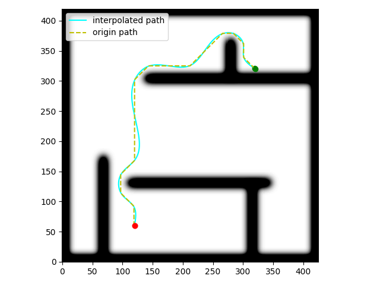
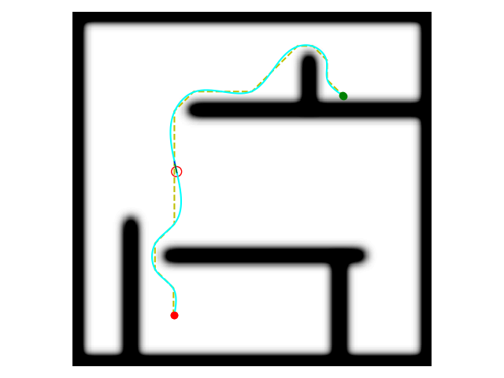
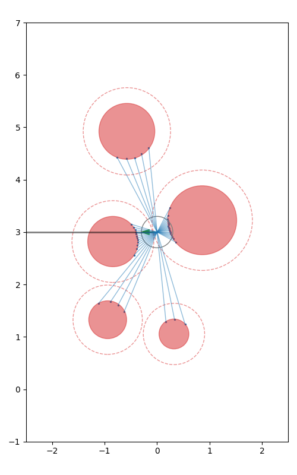

# Path Planning and Motion Control
Perception, Planning and Controlling

# Prerequisite

```bash
# 1.  Part 1
# 1.1 for conda environment
conda install -c conda-forge ffmpeg
# 1.2 for python environment
pip install ffmpeg-python

# 2. Part 2
pip install pypng casadi
```

# Execution

## Path Planning and Trajectory Generation

### A* + Spline
```bash
# Use A* find a path and Spline to interpolate the path
python test/gridmap_astar.py
```


### Motion Planning
```bash
# Use mpc to control a differential drive model
python test/motion_planning.py
```


### Map Generation
```bash
# Test the circle obstacle and laser sensor detection
python envs/shapemap.py
```


# Reference

## Path Planning and Trajectory Optimization
https://github.com/libai1943/CartesianPlanner  
https://github.com/icsl-Jeon/traj_gen  
https://github.com/richardos/occupancy-grid-a-star  


## Motion Controller

### General
https://github.com/Shunichi09/PythonLinearNonlinearControl  
https://github.com/tud-amr/localPlannerBench 
### MPC
https://github.com/kohonda/mpc_tracker_ros  
https://github.com/tomcattiger1230/CasADi_MPC_MHE_CPP  
https://github.com/alexliniger/MPCC  
https://github.com/tud-amr/amr-lmpcc  
https://github.com/jan9419/Generic_NMPC_Cpp  
https://github.com/taewankim1/sequential_convex_programming*  
https://github.com/samarth-kalluraya/Obstacle_Avoidance_MPC_Controller_A_star_Planning  
https://github.com/xinjie-liu/SafeMPC_ObstacleAvoidance  
https://github.com/jaidevshriram/Robotics-Navigation  
https://github.com/Vassil17/Safe_Nonholonomic_MPC  
https://github.com/helgeanl/GP-MPC  
https://github.com/xinjie-liu/SafeMPC_ObstacleAvoidance  
https://github.com/epfl-lasa/dynamic_obstacle_avoidance*  
https://github.com/libai1943/CartesianPlanner*  

#### Chance-Constrained
https://github.com/StanfordASL/ccscp    

### CBF
https://github.com/HybridRobotics/cbf  

## Environment Perception
### TSDF, ESDF  
https://github.com/nvidia-isaac/nvblox  
### Large convex polytopes  
https://github.com/StarryN/Galaxy  

## Mobile Manipulator
https://github.com/caelan/SS-Replan 

## Multi Robot
https://github.com/LIJUNCHENG001/multi_robot_traj_planner

